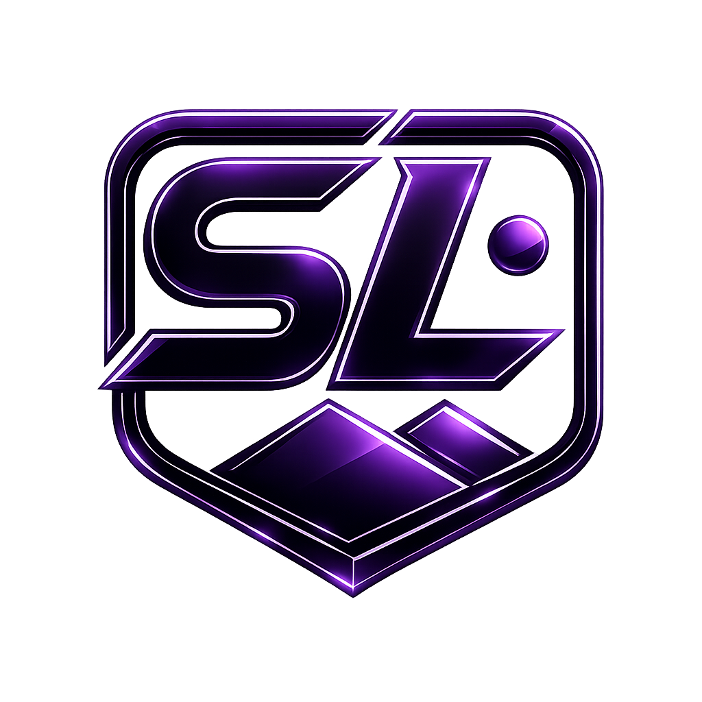

<div align="center">
  
  <h1>ImageSL</h1>
  <p><b>AI-powered IHC histology analysis — deep vision reasoning + true stain separation, delivered through a premium web app and a thin, secure desktop client.</b></p>
</div>

---

## What it is

ImageSL decodes heavy `.tif` immunohistochemistry (IHC) slides, separates the
**true chromogenic stain from background and counterstain for any color**,
quantifies it, and lets you re-render the image however you want to see it — all
with a built-in Claude-powered assistant.

The system is split so that **all proprietary logic runs remotely** on Railway.
The Windows download is a thin native shell with nothing to decompile.

| Pillar | How it's delivered |
| --- | --- |
| **Premium UI & branding** | Dark, glassy, violet-on-black design matching the SL shield logo; logo used across the site, app, client, and favicon. |
| **Website + instant download** | Landing site with an instant *Download for Windows* button and a *Launch Web App* button. |
| **Source protection** | Thin-client architecture — the `.exe` only uploads slides and shows results; deconvolution, AI, and API keys live only on the backend. |
| **IHC AI** | Color deconvolution + automatic **Macenko** stain-vector estimation (works for any stain color) + Otsu quantification, with a **Claude vision** reasoning layer that inspects each slide and tunes the analysis. |
| **Customizable renders** | Recolor the background to any code and make the target staining darker/lighter — generated on demand. |
| **AI chatbot** | The ImageSL Assistant streams answers and is aware of the current slide's numbers. |

> ⚕️ ImageSL assists interpretation. It is **not** a clinical diagnosis; results
> must be confirmed by a qualified pathologist.

## Repository layout

```
ImageSL/
├── server/                  # FastAPI backend (deployed to Railway)
│   ├── app.py               # routes: site, /app, /api/*, /download/windows
│   ├── ihc/engine.py        # THE analysis: OD → Macenko → deconvolution → Otsu → variants
│   ├── ai/claude_client.py  # Claude vision reasoning + streaming chatbot
│   ├── web/                 # premium site (index.html, app.html, styles.css, app.js) + logo
│   └── requirements.txt
├── client/                  # thin Windows client (pywebview shell) — no logic inside
│   ├── imagesl_client.py
│   ├── ImageSL.ico          # generated from the logo (7 sizes)
│   ├── app.manifest / version_info.txt / config.json
│   └── requirements.txt
├── scripts/                 # make_ico.ps1, build_client.ps1
├── docs/                    # ARCHITECTURE.md, SECURITY.md, DEPLOY.md
├── Dockerfile, railway.json, .env.example
```

## Quick start

### 1. Run the backend locally

```bash
cd server
python -m venv .venv && . .venv/Scripts/activate      # Windows: .venv\Scripts\Activate.ps1
pip install -r requirements.txt
setx ANTHROPIC_API_KEY "sk-ant-..."                    # optional; AI degrades gracefully without it
uvicorn app:app --reload
```

Open <http://localhost:8000> (site) and <http://localhost:8000/app> (analyzer).

### 2. Deploy to Railway

See **[docs/DEPLOY.md](docs/DEPLOY.md)** — push this repo, Railway builds the
`Dockerfile`, you set `ANTHROPIC_API_KEY` and license keys in the Variables tab.

### 3. Build the Windows client

```powershell
powershell -ExecutionPolicy Bypass -File scripts/build_client.ps1
```

Set the client's backend URL in `client/config.json` first. Then **code-sign**
the exe (see **[docs/SECURITY.md](docs/SECURITY.md)**) and copy it to
`server/dist/ImageSL.exe` so `/download/windows` serves it.

## The important honesty section

Two of the original requirements can't be delivered exactly as worded, so
ImageSL delivers the real, working version of each:

1. **"The .exe won't be flagged by Defender/SmartScreen."** No build technique
   guarantees this — SmartScreen is driven by **code-signing reputation**, not
   compilation. The client is built clean and unobfuscated (which keeps AV
   heuristics calm), but the durable fix is an OV/EV certificate. Full detail
   and the exact signing steps are in [docs/SECURITY.md](docs/SECURITY.md).

2. **"AI reasons pixel-by-pixel."** The per-pixel stain/background separation is
   done by rigorous digital-pathology math (color deconvolution + Macenko +
   Otsu — the same methods as QuPath/Fiji), and Claude's vision model reasons
   *on top* to identify the stain and tune the parameters. That combination is
   genuinely powerful; an LLM does not segment a gigapixel slide per-pixel, and
   ImageSL doesn't pretend it does.

See [docs/ARCHITECTURE.md](docs/ARCHITECTURE.md) for the full design.
